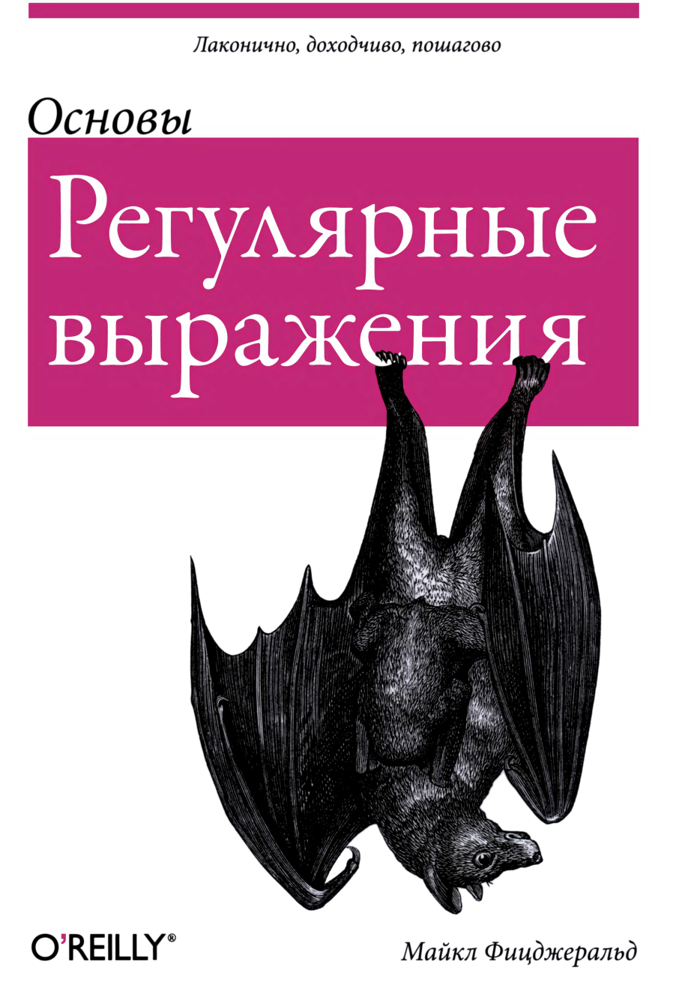

# Материалы из книги:
### Майкл Фицджеральд - Регулярные выражения. Основы - 2015

## Замечание:
> Примеры из учебника рассмотрены на языке perl или в программе grep которая имеется в системах Unix,
> но ее нет на Windows! Большенство примеров я не смог повторить, и в основном примеры я 
> составил основываясь на общих возможностях языка регулярных выражений используя python.

## Для кого эта книга:
> Предполагаемые читатели книги - люди, которые за всю свою жизнь не написали 
> еще ни одного регулярного выражения. Если вам уже приходилось сталкиваться с регулярными выражениями, но ваша 
> практика работы с ними довольно ограниченна, то эта книга будет для вас полезной.

## Рекомендации по другим книгам:
> - Джеффри Фридла Регулярные выражения, 3-е издание (Символ-Плюс, 2008 г.)  
> - Яна Гойвертса и Стивена Левитана Регулярнье выражения. Сборник рецептов, 2-е издание (Символ-Плюс, 2015 r.)

## Определения:
> ***Регулярные выражения:*** это специальные текстовые строки, которые используются 
> в качестве шаблонов (образцов) для сопоставления с наборами других строк.
> Другими словами, это последовательность инструкций для поиска совпадений со строковыми литералами в тексте.

> ***Строковый литерал:*** это буквальное представление строки.

# Метасимволы или управляющие символы:
| символ | описание                                                                                                    |
|--------|-------------------------------------------------------------------------------------------------------------|
| `\\`   | Служит для экранирования служебных символов например `\{` или же как часть метасимвола к примеру `\d`       |
| `^`    | Обозначает начало строки                                                                                    |
| `$`    | Обозначает конец строки                                                                                     |
| `.`    | Точка обозначает любой одиночный символ                                                                     |

> __Метасимволы__: это специальные символы в регулярных выражениях, которые не обозначают сами себя, а выполняют особые 
> функции для формирования шаблонов поиска. Они помогают управлять логикой поиска и указывать, 
> как интерпретировать символы или группы символов в строке.

# Символьные классы или скобочные выражения:
| символ    | описание                                                                                                                                                                                                     |
|-----------|--------------------------------------------------------------------------------------------------------------------------------------------------------------------------------------------------------------|
| `[0-9]`   | Находит совпадение с элементами перечисленными в квадратных скобках. `[0-9]` так же можно представить в виде списка цифр `[0123456789]` и найдет любую одиночную цифру                                       |
| `[^]`     | Инвертирование. В контексте символьного класса указывается в самом начале и обозначает отрицание то есть "найти любой символ не входящий в символьный класс". Пример `[^\d]` вернет любой символ кроме цифр. |

> ***Символьные классы:*** последовательность символов, заключенная в квадратные скобки, называется "символьным классом".

# Символьные сокращения:
| символ   | описание                                                                                                    |
|----------|-------------------------------------------------------------------------------------------------------------|
| `\b`     | Граница слова.                                                                                              |
| `[\b]`   | Возврат на шаг (забой)                                                                                      |
| `\B`     | Не граница слова                                                                                            |
| `\cx`    | Управляющий символ из таблици `ASCII` начиная от `0` до `31`                                                |
| `\d`     | Обозначает любую одиночную цифру от `0` до `9`                                                              |
| `\d xxx` | Десятичное значение кода символа                                                                            |
| `\D`     | Обозначает любой символ не являющийся цифрой (любой символ кроме диапазона `0-9`)                           |
| `\f`     | Прогон страницы                                                                                             |
| `\h`     | Горизонтальный пробел                                                                                       |
| `\H`     | Не горизонтальный пробел                                                                                    |
| `\n`     | Перевод строки                                                                                              |
| `\r`     | Перевод каретки                                                                                             |
| `\o xxx` | Восьмеричное значение кода символа                                                                          |
| `\s`     | Пробел (пустой символ)                                                                                      |
| `\S`     | Не пробел (не пустой символ)                                                                                |
| `\t`     | Символ горизонтальной табуляции                                                                             |
| `\v`     | Символ вертикальной табуляции ( вертикальный пробел)                                                        |
| `\V`     | Не вертикальный пробел                                                                                      |
| `\w`     | Соответствует любому символу буквенному, цифирному или _ аналог `[_a-zA-Z0-9]`                              |
| `\W`     | Соответствует любому символу не входящему в буквенные, циферные или _ и  и является противоположностью `\w` |
| `\0`     | Пустой символ (Null)                                                                                        |
| `\x xx`  | Шестнадцатеричное значение кода символа                                                                     |
| `u xxxx` | Символ в кодировке Unicode                                                                                  |

> ***Символьное сокращение или символьная маска:*** укороченное представление целых символьных классов.   
***Пример:*** \d является символьным сокращение символьного класса `[0-9]` 

# Квантификаторы:
| символ       | описание                                                                                                          |
|--------------|-------------------------------------------------------------------------------------------------------------------|
| `{number}`   | Обозначает что предыдущий символ или группа символов должны повторяться `number` раза                             |
| `{min, max}` | Обозначает что предыдущий символ или группа символов должны повторяться минимум `min` раза и максимум `max` раз   |
| `?`          | Означает что предыдущий символ должен повториться `0` или `1` раз                                                 |
| `+`          | Означает что предыдущий символ должен повторяться `1` или более раз                                               |
| `*`          | Означает что предыдущий символ должен повторяться `0` или более раз                                               |
| `??`         | Ленивый поиск, при котором предыдущий символ или группа может встретиться в данной позиции нуль или один раз      |
| `+?`         | Ленивый поиск, при котором предыдущий символ или группа может встретиться в данной позиции один или более раз     |
| `*?`         | Ленивый поиск, при котором предыдущий символ или группа может встретиться в данной позиции нуль или более раз     |
| `{n}?`       | Ленивый поиск ровно `n` повторений предыдущего символа или группы                                                 |
| `{n,}?`      | Ленивый поиск `n`или более повторений предыдущего символа или группы                                              |
| `{m,n}?`     | Ленивый поиск не менее чем `n` и не более чем т повторений предыдущего символа или группы                         |
| `?+`         | Сверхжадный поиск, при котором предыдущий символ или группа может встретиться в данной позиции нуль или один раз  |
| `++`         | Сверхжадный поиск, при котором предыдущий символ или группа может встретиться в данной позиции один или более раз |
| `*+`         | Сверхжадный поиск, при котором предыдущий символ или группа может встретиться в данной позиции нуль или более раз |
| `{n}+`       | Сверхжадный поиск ровно n повторений предыдущего символа или группы                                               |
| `{n,}+`      | Сверхжадный поиск n или более повторений предыдущего символа или группы                                           |
| `{m,n}+`     | Сверхжадный поиск не менее чем n и не более чем m повторений предыдущего символа или группы                       |

> __Квантификаторы__: это символы или последовательности символов в регулярных выражениях, которые указывают
> количество повторений символа или группы символов. Они определяют, сколько раз должен встречаться указанный элемент
> (символ или группа символов) для соответствия шаблону.

> __Ленивый квантификатор__: Он пытается обнаружить совпадение, начиная с самоrо первоrо символа тестируемой строки. 
> Далее он просматривает всю строку по одному символу за раз в поиске совпадения. 
> Наконец, он пытается найти совпадение со всей строкой. Чтобы превратить обычный квантификатор в ленивый, 
> перед ним необходимо записать вопросительный знак `?`. Ленивый квантификатор "пережевывает" строку небольшими порциями.

> __Жадный квантификатор__: Обычный квантификатор изначально является "жадным". Жадный квантификатор в первую очередь стремится обнаружить 
> совпадение со всей строкой. Он захватывает столько, сколько может, целую строку, пытаясь обнаружить совпадение. Если 
> первая попытка оказывается неудачной, он возвращается на один символ и повторяет попытку. Этот процесс называют 
> бектрекингом или поиском с возвратом. Пошаrовый возврат на один символ продолжается до тех пор, пока не будет 
> обнаружено совпадение или не исчерпаются все символы. Кроме тоrо, жадный квантификатор сохраняет информацию о каждом
> своем действии и поэтому потребляет наибольшее количество ресурсов по сравнению с двумя друrими разновидностями 
> квантификаторов, к рассмотрению которых мы переходим. 

> __Сверхжадный квантификатор__: пытается найти совпадение, захватывая целиком всю строку, но делает это в рамках одной попытки,
> не прибеrая к поиску с возвратом. Чтобы превратить обычный квантификатор в сверхжадный, перед ним необходимо 
> записать знак "плюс" `+`. Сверхжадный квантификатор не тратит время на "пережевывание" строки, а "rлотает" ее 
> целиком и только после этоrо пытается понять, а что же именно он "съел". 

# Захватывающие и незахватывающие группы, а так-же обратные ссылки:
| символ          | описание                                                                                                                                                                                       |
|-----------------|------------------------------------------------------------------------------------------------------------------------------------------------------------------------------------------------|
| `(Hello world)` | Создает группу символов которая доступна по ссылке `\index`                                                                                                                                    |
| `\|`            | Обозначает логическое `ИЛИ` то есть одно из двух возможных значений пример `(Hello\|hello)`. Не обязательно использовать в () однако в противном случае будет делить на условия все выражение! |
| `\index`        | Обращение к соответствующей группе символов по ссылке где `index` это номер группы                                                                                                             |
| `(?P<name>)`    | Именованная группа в Python. Получение доступа к этой группе осуществляется не по ссылке а по имени. Пример `(?P<name>\w+)`                                                                    |
| `(?P=name)`     | Ссылка на группу по ее имени в Python                                                                                                                                                          |
| `(?:)`          | Незахватывающая группа. Не сохраняется в памяти, и не имеет ссылки на не нее.                                                                                                                  |
| `(?i:)`         | Дополнительный пример использования незахватывающей группы с доп настройками вроде `(?i)` нечувствительности к регистру.                                                                       |
| `(?>the)`       | Атомарная группа.                                                                                                                                                                              |

> __Захватывающие группы__: это части регулярных выражений, заключенные в круглые скобки `()`, которые не только 
> группируют символы для применения к ним квантификаторов, но и позволяют извлекать найденные подстроки (то есть "захватывать" их). 
> Эти захваченные подстроки могут быть использованы позже, например, для анализа, замены или повторного использования.

# Группы проверки:
| символ                  | описание                                                                                                            |
|-------------------------|---------------------------------------------------------------------------------------------------------------------|
| `ancyent(?=marinere)`   | Положительная опережающая проверка. Находит все вхождения текста `ancyent` после которых следует `marinere`.        |
| `ancyent(?!marinere)`   | Отрицательная опережающая проверка. Находит все вхождения текста `ancyent` после которых НЕ следует `marinere`.     |
| `(?<=ancyent) marinere` | Положительная ретроспективная проверка. Находит все вхождения текста `marinere` перед которым следует `ancyent`.    |
| `(?<!ancyent) marinere` | Отрицательная ретроспективная проверка. Находит все вхождения текста `marinere` перед которым НЕ следует `ancyent`. |

> __Группы проверки__: это конструкции в регулярных выражениях, которые позволяют осуществлять проверки условий на 
> текстовые строки без включения этих условий в сам результат. Они бывают опережающие(положительные) и ретроспективные(Отрицательные).

# Опции:
| символ    | описание                                      |
|-----------|-----------------------------------------------|
| `(?d)`    | Строки Unix                                   |
| `(?i)`    | Игнорирует регистр символов                   |
| `(?J)`    | Разрешить одинаковые имена подшаблонов        |
| `(?m)`    | Обрабатывать текст как многострочный          |
| `(?s)`    | Обрабатывать текст как одну строку            |
| `(?u)`    | Обрабатывать шаблоны как строки Unicode       |
| `(?U)`    | Делает модификаторы "нежадными" по умолчанию  |
| `(?x)`    | Игнорировать пробельные символы и комментарии |
| `(?d)`    | Строки Unix                                   |
| `(?-...)` | Сброс или отключение опций                    |

# Символьные классы POSIX:
| символ         | описание                       |
|----------------|--------------------------------|
| `[[:alnum:]]`  | Алфавитно-цифровые символы     |
| `[[:alpha:]]`  | Алфавитные символы             |
| `[[:ascii:]]`  | АSСll-символы (все 128)        |
| `[[:Ыank:]]`   | Пробельные символы             |
| `[[:ctrl:]]`   | Управляющие символы            |
| `[[:digit:]]`  | Цифры                          |
| `[[:graph:]]`  | Графические символы            |
| `[[:lower:]]`  | Буквы нижнего регистра         |
| `[[:print:]]`  | Печатные символы               |
| `[[:punct:]]`  | Знаки пунктуации               |
| `[[:space:]]`  | Пробел                         |
| `[[:uppe:]]`   | Буквы верхнего регистра        |
| `[[:word:]]`   | Словарные символы              |
| `[[:xdigit:]]` | Шестнадцатеричные цифры        |

> Символьные классы POSIX не поддерживаются в Python. 
> Вместо них используются обычные символьные классы вроде \d или \w
